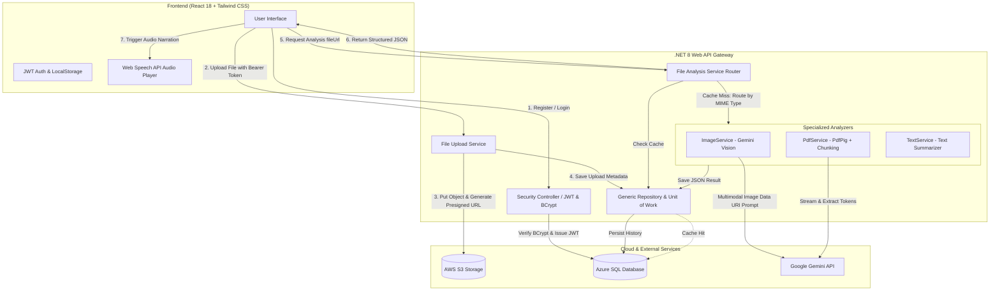
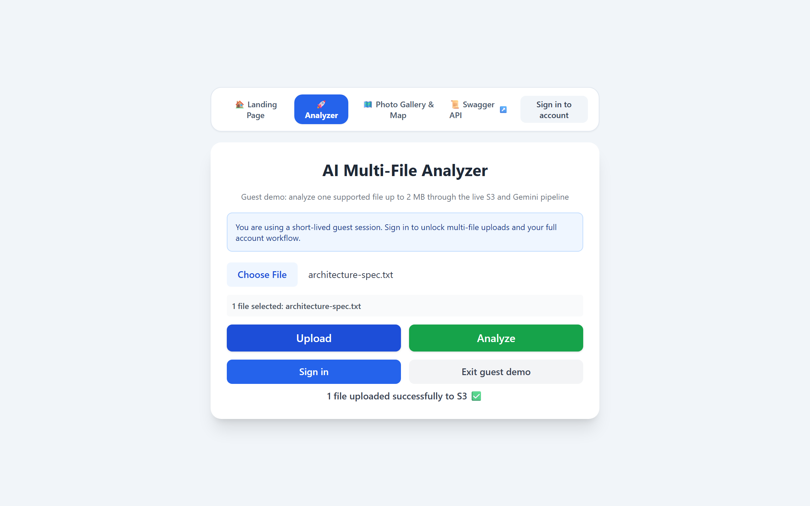
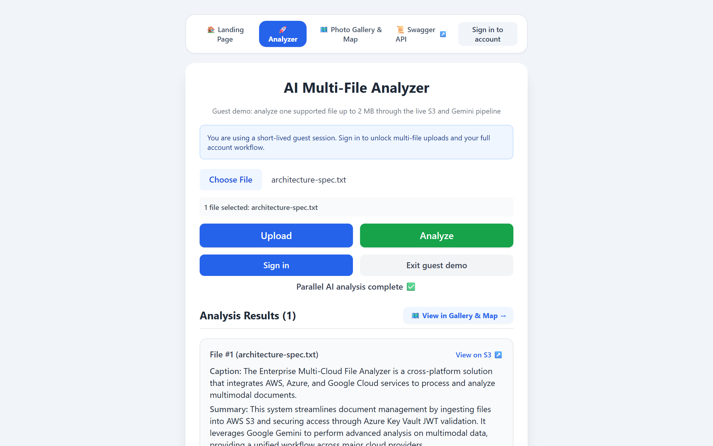
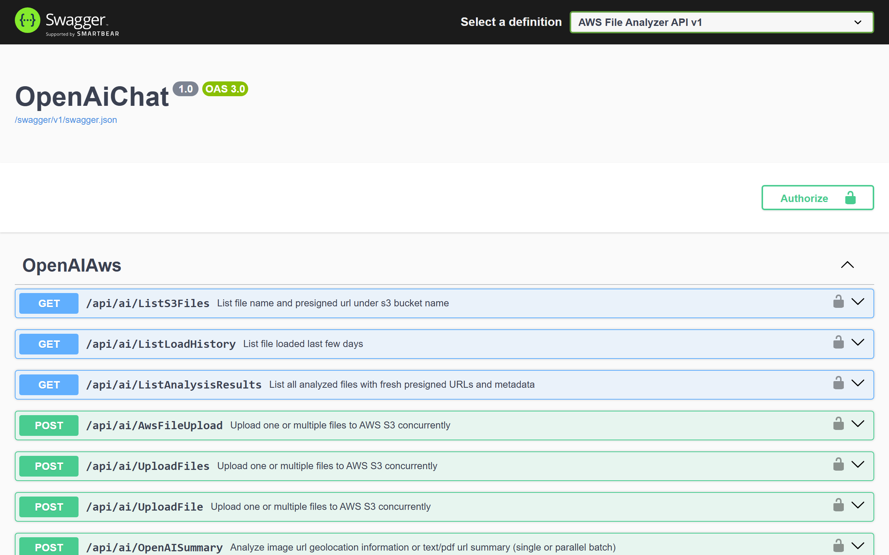
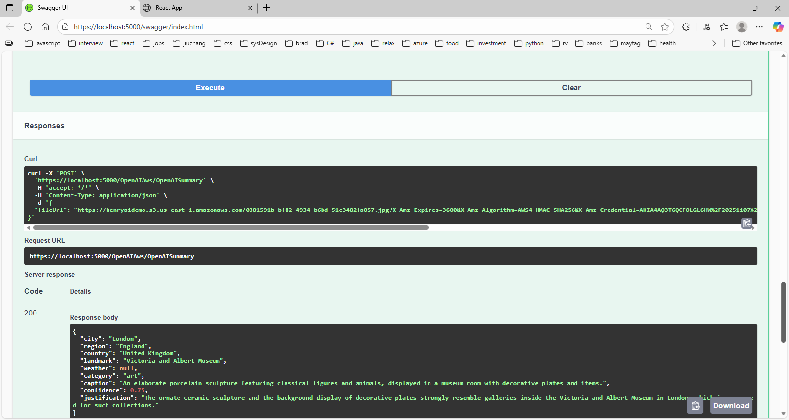

# ☁️ AWS File Analyzer & AI Multimodal Summarizer

> **An intelligent, full-stack cloud application that ingests local documents and images into AWS S3, performs multimodal AI analysis via Google Gemini, caches results in Azure SQL, and synthesizes speech narration in real-time.**

[](https://dotnet.microsoft.com/)
[](https://react.dev/)
[](https://aws.amazon.com/s3/)
[](https://azure.microsoft.com/en-us/products/azure-sql/)
[](https://ai.google.dev/)
[](https://tailwindcss.com/)

---

## 📌 Overview

**AWS File Analyzer** bridges enterprise cloud infrastructure with multimodal generative AI. It is designed to demonstrate cloud architecture best practices:

1. **Secure Ingestion**: Ingests files into private Amazon S3 buckets and generates cryptographically signed, short-lived **Pre-Signed URLs** to maintain least-privilege security.
2. **Multimodal AI Analysis**: Routes files through specialized intelligence pipelines powered by **Google Gemini**, starting with `gemini-3.1-flash-lite` and automatically falling back across compatible Flash models when a model is rate-limited or temporarily unavailable.
3. **Cost-Efficient Caching**: Persists file metadata and structured JSON analysis in Azure SQL to eliminate duplicate AI token costs.
4. **Interactive Browser Speech**: Synthesizes client-side audio playback using the browser's native Web Speech API.

---

## 🏛️ System Architecture



---

## ✨ Key Features

* **🔒 End-to-End JWT Authentication**: Secure user registration and login with BCrypt password hashing, bearer token authorization, and token persistence.
* **☁️ AWS S3 Cloud Ingestion**: Reliable direct streaming to Amazon S3 buckets with time-limited pre-signed URLs (60-minute TTL) for secure access delegation.
* **👁️ Multimodal Image Intelligence**: Powered by Google Gemini (`gemini-3.1-flash-lite`), providing geolocation estimation, landmark identification, weather inference, category tagging, confidence scoring, and justification strings.
* **📄 Chunked PDF & Document Summarization**: Binary stream extraction using `PdfPig`, intelligent text-chunking (`4000` byte windows) for large multi-page documents, and hierarchical summary aggregation.
* **💾 Intelligent Result Caching**: Avoids redundant API calls and reduces LLM inference costs by checking Azure SQL for prior analysis before making external requests.
* **🔊 Audio Narration**: Built-in browser speech synthesis (`SpeechSynthesisUtterance`) that reads image captions and document highlights aloud.
* **🏛️ Clean Architecture**: Implements Repository Pattern, Unit of Work, Dependency Injection, and global exception handling.

---

## 🖼️ Application Preview

| File Upload Pipeline | Structured AI Analysis |
| :---: | :---: |
|  |  |

| Backend Swagger REST API | Image Geolocation Response |
| :---: | :---: |
|  |  |

---

## 🛠️ Technology Stack

| Domain | Technology | Purpose |
| :--- | :--- | :--- |
| **Backend** | C# / ASP.NET Core 8 Web API | High-throughput REST API and service layer |
| **Data Layer** | Entity Framework Core, Azure SQL / MSSQL | Database migrations, relational persistence, repository abstraction |
| **Cloud Storage** | AWS S3 (`AWSSDK.S3`) | Secure, scalable object storage with pre-signed URLs |
| **AI / Multimodal** | Google Gemini Flash fallback chain | Multimodal vision analysis, geolocation detection, structured JSON summarization, transient retries, and rate-limit failover |
| **Document Processing**| `UglyToad.PdfPig` | High-performance PDF stream text extraction |
| **Security** | JWT (JSON Web Tokens), `BCrypt.Net-Next` | Token authentication and password hashing |
| **Frontend** | React 18, Axios, Tailwind CSS v3 | Responsive single-page application and auth state |
| **Audio** | Web Speech API | Client-side text-to-speech audio player |

---

## 📐 API Reference

### Security Endpoints
* `POST /api/Security/register` - Register a new user with BCrypt-hashed password.
* `POST /api/Security/login` - Authenticate credentials and receive Access & Refresh JWT tokens.

### File & AI Analysis Endpoints
* `POST /OpenAIAws/AwsFileUpload` - Upload multipart file to S3, persist metadata to DB, and return 60-min pre-signed URL.
* `POST /OpenAIAws/GeminiSummary` (also `/OpenAISummary`) - Perform AI analysis on uploaded file URL (Image vision, PDF summary, or text summary).
* `GET /OpenAIAws/ListS3Files` - List all S3 objects in bucket with generated pre-signed URLs.
* `GET /OpenAIAws/ListLoadHistory` - Retrieve upload history filtered by date range and file count.
* `GET /OpenAIAws/ListAnalysisResults` - Query joined upload history and cached AI analysis results.
* `POST /OpenAIAws/GeminiChat` (also `/OpenAIChat`) - General text chat completion endpoint.

---

## 💡 Key Engineering Decisions & Trade-Offs

### 1. Pre-Signed URLs vs. Direct Streaming to AI
* **Decision**: Generate time-limited AWS S3 Pre-Signed URLs (60-minute expiry) to pass to downstream AI services rather than loading heavy raw binary payloads into server RAM.
* **Trade-off**: Requires AWS IAM credentials configured with `s3:GetObject` permissions for the bucket, but dramatically reduces memory footprint and enables asynchronous client access.

### 2. Azure SQL Result Caching
* **Decision**: Before invoking Gemini, query the `FileAnalysisResult` table using the pre-signed URL / object key.
* **Trade-off**: Slight database lookup latency on first run in exchange for near-instant response times and 100% token cost elimination on repeated queries.

### 3. PDF Chunking Strategy
* **Decision**: Files exceeding 12,000 characters are partitioned into 4,000-byte chunks, summarized individually, and synthesized into a final aggregate summary.
* **Trade-off**: Multiple smaller parallel LLM calls prevent token window overflow and preserve context fidelity across multi-page documents.

---

## 🚀 Getting Started

### Prerequisites
* [.NET 8 SDK](https://dotnet.microsoft.com/download/dotnet/8.0)
* [Node.js (v18+)](https://nodejs.org/) and npm
* [AWS Account](https://aws.amazon.com/) with an S3 Bucket and configured AWS CLI (`aws configure`)
* [Google Gemini API Key](https://aistudio.google.com/)
* SQL Server or Azure SQL Database instance

### 1. Backend Setup
```bash
cd backend

# Configure your connection string and AWS bucket in appsettings.Development.json:
# {
#   "ConnectionStrings": { "DefaultConnection": "<YOUR_AZURE_SQL_CONNECTION_STRING>" },
#   "AWS": { "S3BucketName": "<YOUR_S3_BUCKET_NAME>", "Region": "us-east-1" },
#   "Gemini": { "Models": ["gemini-3.1-flash-lite", "gemini-3.5-flash-lite", "gemini-2.5-flash"] }
# }

# Configure your Gemini API Key securely with .NET User Secrets:
dotnet user-secrets set "Gemini:ApiKey" "<YOUR_GEMINI_API_KEY>"

# Restore packages and update database migrations
dotnet restore
dotnet ef database update

# Run backend API (runs on https://localhost:5000)
dotnet run
```

### 2. Frontend Setup
```bash
cd frontend

# Install dependencies
npm install

# Start development server (runs on http://localhost:3000)
npm start
```

---

## 🔮 Roadmap
- [ ] AWS Lambda trigger for asynchronous background processing.
- [ ] Visual Photo Album & Map View plotted from extracted image GPS/landmark coordinates.
- [ ] Vector embeddings with pgvector / Azure AI Search for semantic document querying.
- [ ] Comprehensive unit and integration test suite with `xUnit` and `boto3`/AWS localstack mocking.
