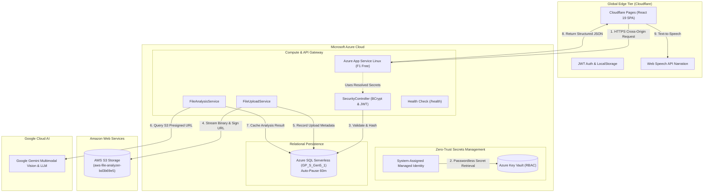

# ☁️ AWS File Analyzer & AI Multimodal Summarizer

> **An enterprise multi-cloud intelligent document intelligence platform. Hosted on Cloudflare Pages, powered by .NET 8 on Azure App Service with Azure Key Vault Managed Identity, persisted in Azure SQL Serverless, storing media in AWS S3, and driven by Google Gemini Multimodal Vision & LLMs.**

[](https://aws-file-analyzer.pages.dev)
[](https://app-afa-eycaz6z3q3pp4.azurewebsites.net/health)
[](https://dotnet.microsoft.com/)
[](https://react.dev/)
[](https://pages.cloudflare.com/)
[](https://azure.microsoft.com/)
[](https://azure.microsoft.com/)
[](https://azure.microsoft.com/en-us/products/azure-sql/)
[](https://aws.amazon.com/s3/)
[](https://ai.google.dev/)

---

## 📌 Live Demo & Overview

* **Production Web App:** [https://aws-file-analyzer.pages.dev](https://aws-file-analyzer.pages.dev)
* **Backend API Endpoint:** [https://app-afa-eycaz6z3q3pp4.azurewebsites.net](https://app-afa-eycaz6z3q3pp4.azurewebsites.net)
* **Interactive Swagger UI:** [https://app-afa-eycaz6z3q3pp4.azurewebsites.net/swagger](https://app-afa-eycaz6z3q3pp4.azurewebsites.net/swagger)
* **Health Check:** [https://app-afa-eycaz6z3q3pp4.azurewebsites.net/health](https://app-afa-eycaz6z3q3pp4.azurewebsites.net/health)

**AWS File Analyzer** demonstrates enterprise multi-cloud orchestration across **Cloudflare**, **Microsoft Azure**, **Amazon Web Services (AWS)**, and **Google Cloud (Gemini AI)**:

1. **Global Edge Delivery**: React 19 SPA deployed on **Cloudflare Pages** edge network for sub-millisecond static asset delivery, instant SSL, and full deep linking across SPA routes (`/`, `/analyzer`, `/gallery`, `/gallery?view=map`, `/login`).
2. **Unified Navigation & Interactive API Access**: Persistent top-level navigation links provide instant switching between the **Landing Page**, **Live Analyzer**, **Photo Gallery & Map**, and direct one-click **Swagger API Documentation** from all main application views.
3. **Zero-Trust Identity & Secrets**: .NET 8 API running on **Azure App Service Linux** leveraging **System-Assigned Managed Identity** to retrieve cryptographic JWT signing keys and API credentials from **Azure Key Vault** (zero secrets stored in code or repository).
4. **Multi-File Parallel AWS S3 Ingestion**: Ingests multiple files concurrently using `Task.WhenAll` into private Amazon S3 buckets and returns short-lived, cryptographically signed **Pre-Signed URLs** (60-min TTL). Database state is synchronized using concurrency-safe thread locks.
5. **Concurrent Multimodal Generative AI**: Analyzes batches of images, PDFs, and text documents in parallel using **Google Gemini**, with a cost-first fallback hierarchy scaling up to `gemini-3.8-flash`.
6. **Seamless Dual Authentication**: Supports email/password registration with instant auto-login token issuance, as well as one-tap **Google OAuth 2.0** with automatic account provisioning.
7. **Cost-Controlled Serverless Database**: Stores user auth, upload history, and cached AI results in **Azure SQL Serverless** configured with a 60-minute auto-pause, resulting in an estimated **$0/month operating cost**.
8. **End-to-End Reliability**: Validated across a **65-test automated testing pyramid** (26 xUnit backend, 29 Vitest frontend, 10 Playwright E2E) with dual GitHub Actions CI/CD workflows deploying on green commits.

---

## 🏛️ Multi-Cloud System Architecture



---

## ✨ Key Features

* **🔒 End-to-End JWT Authentication**: Secure user registration and login with BCrypt password hashing, bearer token authorization, and token persistence.
* **🧪 Protected Guest Demo**: Short-lived, non-persistent guest JWTs let recruiters run one real file through S3 and Gemini without registering; tighter upload and hourly request limits protect the free-tier services.
* **🔄 Seamless Guest History Claiming**: Visitors can test the analyzer as a guest, then sign in or register with zero loss of progress—all guest files, Gemini analyses, and audio players are claimed and hydrated directly into their account.
* **☁️ AWS S3 Cloud Ingestion**: Reliable direct streaming to Amazon S3 buckets with time-limited pre-signed URLs (60-minute TTL) for secure access delegation.
* **👁️ Multimodal Image Intelligence**: Powered by Google Gemini (`gemini-3.1-flash-lite`), providing geolocation estimation, landmark identification, weather inference, category tagging, confidence scoring, and justification strings.
* **📄 Chunked PDF & Document Summarization**: Binary stream extraction using `PdfPig`, intelligent text-chunking (`4000` byte windows) for large multi-page documents, and hierarchical summary aggregation.
* **💾 Intelligent Result Caching**: Avoids redundant API calls and reduces LLM inference costs by checking Azure SQL for prior analysis before making external requests.
* **🔊 Audio Narration**: Built-in browser speech synthesis (`SpeechSynthesisUtterance`) that reads image captions and document highlights aloud.
* **🏛️ Clean Architecture**: Implements Repository Pattern, Unit of Work, Dependency Injection, and global exception handling.

---

## 🖼️ Application Preview

| File Upload Pipeline | Structured AI Analysis |
| :---: | :---: |
|  |  |

| Backend Swagger REST API | Image Geolocation Response |
| :---: | :---: |
|  |  |

---

## 🛠️ Technology Stack

| Domain | Technology | Purpose |
| :--- | :--- | :--- |
| **Frontend Hosting** | Cloudflare Pages | Global low-latency edge deployment, continuous Git deployments, SSL/TLS |
| **Backend Compute** | Azure App Service (Linux F1) | .NET 8 Web API containerized execution, Kestrel server |
| **Secrets Management**| Azure Key Vault (RBAC) | Zero-trust secret storage resolved dynamically via System-Assigned Managed Identity |
| **Data Layer** | Azure SQL Serverless (`GP_S_Gen5_1`) | Relational persistence with 60-minute auto-pause for \$0 cost ceiling |
| **Cloud Storage** | AWS S3 (`AWSSDK.S3`) | Encrypted object storage with short-lived presigned URLs |
| **AI / Multimodal** | Google Gemini Multimodal Vision & LLM | Document summarization, image vision, and fallback hierarchy |
| **Document Processing**| `UglyToad.PdfPig` | High-performance PDF stream text extraction |
| **Security & Auth** | JWT, `BCrypt.Net-Next`, Google OAuth 2.0 | Dual authentication (standard email/password + Google Sign-In) |
| **Frontend Framework**| React 19, Vite 8, Axios, Tailwind CSS v3 | Responsive single-page application, fast builds, and auth state management |
| **Testing** | xUnit, React Testing Library, Playwright | Unit, integration, and end-to-end smoke testing |

---

## 📐 API Reference

### Health & Monitoring
* `GET /health` - API health check endpoint (returns `{"status":"healthy"}`).

### Security & Authentication
* `POST /api/Security/guest-session` - Issue a non-persistent 15-minute Guest JWT for the rate-limited live demo.
* `POST /api/Security/claim-guest-uploads` - Associate pre-signed S3 file URLs generated during a guest demo session into an authenticated user's account with bucket allowlist validation.
* `POST /api/Security/register` - Register a new user with BCrypt-hashed password and receive immediate access tokens (auto-login).
* `POST /api/Security/login` - Authenticate credentials and receive Access & Refresh JWT tokens.
* `POST /api/Security/google-login` - Authenticate via Google ID Token (OAuth 2.0) with automated user registration and JWT token issuance.


### File & AI Analysis Endpoints
* `POST /api/ai/AwsFileUpload` (or `/api/ai/UploadFiles`) - Upload up to five supported multipart files to AWS S3 concurrently, persist metadata safely, and return 60-minute pre-signed URLs.
* `POST /api/ai/GeminiSummary` (also `/api/ai/AnalyzeFiles`) - Perform parallel AI analysis on uploaded file URLs (image vision, PDF summary, or text summary).
* `GET /api/ai/ListS3Files` - List all S3 objects in the configured bucket with generated pre-signed URLs.
* `GET /api/ai/ListLoadHistory` - Retrieve upload history filtered by date range and file count.
* `GET /api/ai/ListAnalysisResults` - Query joined upload history and cached AI analysis results.
* `POST /api/ai/GeminiChat` - General text chat completion endpoint.

Legacy `/OpenAIAws` and `/GeminiAws` route prefixes remain available for backward compatibility but are hidden from Swagger so the public API contract stays focused on `/api/ai`.

---

## 💡 Key Engineering Decisions & Trade-Offs

### 1. Pre-Signed URLs vs. Direct Streaming to AI
* **Decision**: Generate time-limited AWS S3 Pre-Signed URLs (60-minute expiry) to pass to downstream AI services rather than loading heavy raw binary payloads into server RAM.
* **Trade-off**: Requires AWS IAM credentials configured with `s3:GetObject` permissions for the bucket, but dramatically reduces memory footprint and enables asynchronous client access.

### 2. Azure SQL Result Caching
* **Decision**: Before invoking Gemini, query the `FileAnalysisResult` table using the pre-signed URL / object key.
* **Trade-off**: Slight database lookup latency on first run in exchange for near-instant response times and 100% token cost elimination on repeated queries.

### 3. PDF Chunking Strategy
* **Decision**: Files exceeding 12,000 characters are partitioned into 4,000-byte chunks, summarized individually, and synthesized into a final aggregate summary.
* **Trade-off**: Multiple smaller parallel LLM calls prevent token window overflow and preserve context fidelity across multi-page documents.

---

## 🚀 Getting Started

### Prerequisites
* [.NET 8 SDK](https://dotnet.microsoft.com/download/dotnet/8.0)
* [Node.js (v18+)](https://nodejs.org/) and npm
* [AWS Account](https://aws.amazon.com/) with an S3 Bucket and configured AWS CLI (`aws configure`)
* [Google Gemini API Key](https://aistudio.google.com/)
* SQL Server or Azure SQL Database instance

### 1. Backend Setup
```bash
cd backend

# Configure your connection string and AWS bucket in appsettings.Development.json:
# {
#   "ConnectionStrings": { "DefaultConnection": "<YOUR_AZURE_SQL_CONNECTION_STRING>" },
#   "AWS": { "S3BucketName": "<YOUR_S3_BUCKET_NAME>", "Region": "us-east-1" },
#   "Gemini": { "Models": ["gemini-3.1-flash-lite", "gemini-3.5-flash-lite", "gemini-2.5-flash"] }
# }

# Configure your Gemini API Key securely with .NET User Secrets:
dotnet user-secrets set "Gemini:ApiKey" "<YOUR_GEMINI_API_KEY>"

# Restore packages and update database migrations
dotnet restore
dotnet ef database update

# Run backend API (runs on https://localhost:5000)
dotnet run
```

### 2. Frontend Setup
```bash
cd frontend

# Install dependencies
npm install

# Start the Vite development server (runs on http://localhost:5173)
npm run dev
```

---

## 🔮 Roadmap

See [`future_work.md`](future_work.md) for the detailed product and engineering roadmap, including photo collections, Google Photos and OneDrive integrations, and a possible Chrome extension.

- [x] Visual photo collections and interactive Leaflet map view based on extracted landmark coordinates (`/gallery` & `/gallery?view=map`).
- [x] Persistent cross-view navigation (Landing Page, Analyzer, Gallery, and Swagger API documentation links).
- [ ] Connected cloud-photo imports and provider-supported metadata write-back.
- [ ] Browser extension actions for analyzing photos from supported websites.
- [ ] Vector embeddings with pgvector or Azure AI Search for semantic querying.
- [ ] Background processing for larger files and sustained traffic.

## 🚢 Deployment Automation

Every push to `main` executes continuous integration and multi-cloud deployment workflows:

1. **Regression & E2E Validation** ([`.github/workflows/regression.yml`](.github/workflows/regression.yml)): Runs all 26 .NET xUnit tests, all 29 Vite/Vitest component tests, and 10 Playwright browser scenarios across both guest and authenticated user journeys.
2. **Azure App Service Deployment** ([`.github/workflows/deploy-production.yml`](.github/workflows/deploy-production.yml)): Deploys the .NET 8 API to Azure Linux App Service using secretless GitHub OpenID Connect (OIDC) federated credentials (`azure/login@v2`). No permanent Azure passwords or service principal secrets are stored in GitHub repository secrets.
3. **Cloudflare Pages Edge Delivery** ([`https://aws-file-analyzer.pages.dev`](https://aws-file-analyzer.pages.dev)): Continuous deployment is fully automated via GitHub Actions using Cloudflare Wrangler (`cloudflare/wrangler-action@v3`) with repository secret `CLOUDFLARE_API_TOKEN` and variable `PAGES_DEPLOY_ENABLED: true`.

