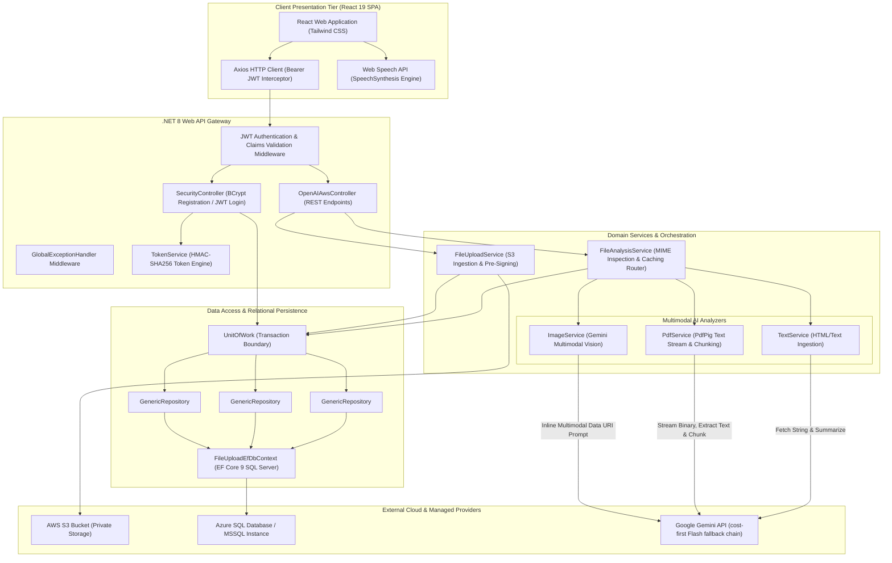

# System Architecture Specification

## 1. Executive Summary

**AWS File Analyzer** is an end-to-end cloud-native document intelligence and multimodal media analysis platform. It enables users to ingest unstructured multi-format files (images, PDFs, text documents) into Amazon S3, routes content through specialized AI processing engines via Google Gemini, persists metadata and cached intelligence in Azure SQL Database, and narrates extracted insights via browser-native speech synthesis.

---

## 2. High-Level Architecture Diagram

---

## 3. Component Breakdown & Responsibilities

### 3.1 Presentation Layer (Frontend)
* **Framework**: React 19 with Vite 8, Tailwind CSS v3, Axios.
* **Responsibilities**:
  * `GuestLanding.jsx`: Presents a public project overview with sample analysis and starts a restricted, short-lived guest session for the live analyzer.
  * `LoginForm.jsx` / `RegisterForm.jsx`: Captures user credentials and acquires JWT token, with support for Google OAuth 2.0 one-tap login and immediate auto-login upon registration.
  * `FileUploadAnalyze.jsx`: Dispatches multipart uploads, triggers multimodal AI analysis, stages guest activity in `pending_guest_claim`, and hydrates claimed sessions upon authentication.
  * `AiVoicePlayer.jsx`: Wraps browser `window.speechSynthesis` and `SpeechSynthesisUtterance` to read AI-generated summaries aloud.

### 3.2 Gateway & Controllers (.NET 8 Web API)
* **`SecurityController`**:
  * `POST /api/Security/guest-session`: Issues a short-lived Guest JWT without inserting an account into Azure SQL.
  * `POST /api/Security/claim-guest-uploads`: Validates S3 bucket ownership and claims pre-signed URLs generated during guest sessions into an authenticated user's account.
  * `POST /api/Security/register`: Salted password hashing via `BCrypt.Net.BCrypt.HashPassword` with automatic JWT issuance.
  * `POST /api/Security/login`: Verifies passwords via `BCrypt.Net.BCrypt.Verify` and issues signed HMAC-SHA256 JWT access and refresh tokens.
  * `POST /api/Security/google-login`: Validates Google ID tokens via `GoogleJsonWebSignature`, provisions new users automatically if non-existent, and issues JWT access tokens.
* **`OpenAIAwsController`** (canonical Swagger prefix `/api/ai`; legacy prefixes retained for compatibility):
  * `POST /api/ai/AwsFileUpload`: Validates up to five supported files for accounts or one file up to 2 MB for guests, pushes them to S3, and returns generated pre-signed URLs.
  * `POST /api/ai/GeminiSummary`: Validates configured-bucket URLs, checks the SQL cache, delegates to the analyzer service, and returns structured JSON.
  * `GET /api/ai/ListS3Files`: Lists objects in S3 with renewed pre-signed URLs.
  * `GET /api/ai/ListLoadHistory`: Queries uploads from the last $N$ days.
  * `GET /api/ai/ListAnalysisResults`: Joins `FileUploadHistory` with `FileAnalysisResult`.
  * `POST /api/ai/GeminiChat`: Provides general text completion through the configured Gemini fallback chain.

Guest JWTs can call only the upload and analysis operations. Bucket listings, account history, saved-result listings, general chat, and guest claim operations require a registered-user role.

### 3.3 Domain Services & AI Pipelines
* **`FileUploadService`**: Manages AWS S3 `PutObjectAsync` and creates 60-minute pre-signed URLs via `GetPreSignedUrlRequest`.
* **`FileAnalysisService`**: Master router. Performs HTTP `GET` header sniffing to detect MIME types (`image/*`, `application/pdf`, `text/*`), checks Azure SQL cache, and persists analysis records.
* **`ImageService`**: Fetches image bytes from S3 pre-signed URL, converts to base64 Data URI part, and invokes Google Gemini (`gemini-3.1-flash-lite`) requesting strict JSON geolocation and landmark metadata.
* **`PdfService`**: Uses `PdfPig` to stream binary PDFs. If text exceeds 12,000 characters, it slices into 4,000-byte segments, gathers partial summaries, and executes an aggregate summarization prompt.
* **`TextService`**: Cleans HTML/whitespace with `HtmlAgilityPack` and produces structured JSON summaries.

---

## 4. Database Schema (Azure SQL / Entity Framework Core)

### `UserLogin`
| Column | Type | Constraints | Purpose |
| :--- | :--- | :--- | :--- |
| `Id` | `int` | Primary Key, Identity | Unique user ID |
| `UserName` | `nvarchar(450)` | Not Null, Unique Index | Unique login handle |
| `PasswordHash` | `nvarchar(max)` | Not Null | BCrypt salted hash string |
| `Role` | `nvarchar(50)` | Nullable | Role authorization claim |

### `FileUploadHistory`
| Column | Type | Constraints | Purpose |
| :--- | :--- | :--- | :--- |
| `Id` | `int` | Primary Key, Identity | Upload event ID |
| `FileName` | `nvarchar(255)` | Not Null | Original file name |
| `FileExtension` | `nvarchar(50)` | Not Null | MIME/extension classification |
| `FileSize` | `bigint` | Not Null | Size in bytes |
| `LoadedTime` | `datetime2` | Not Null | Upload timestamp |
| `PresignedUrl` | `nvarchar(max)` | Not Null | Generated temporary access URL |

### `FileAnalysisResult`
| Column | Type | Constraints | Purpose |
| :--- | :--- | :--- | :--- |
| `Id` | `int` | Primary Key, Identity | Analysis record ID |
| `PresignedUrl` | `nvarchar(450)` | Not Null, Indexed | Matching file URL for cache lookup |
| `AnalysisText` | `nvarchar(max)` | Not Null | JSON response payload from Gemini |

---

| Decision | Selected Option | Alternative Considered | Trade-Off Rationale |
| :--- | :--- | :--- | :--- |
| **AI Provider** | Google Gemini (`gemini-2.5-flash` / `1.5-flash`) | OpenAI GPT-4o | Gemini offers state-of-the-art multimodal vision, higher token limits, lower latency, and zero per-token expense under free-tier allowances. |
| **Media Delivery to LLM** | AWS S3 Pre-Signed URLs + Inline Base64 | Streaming raw byte streams through backend RAM | Eliminates server memory bloat; allows flexible cloud hosting while supporting Gemini's strict input format requirements. |
| **Response Format** | Enforced JSON Object Schema | Free-form Markdown / Natural Language | Guarantees reliable frontend parsing and schema adherence for UI fields without regex parsing. |
| **Result Caching** | Relational Azure SQL Cache | In-memory Redis Cache | Cost efficiency: Leverages existing SQL database without provisioning additional Redis clusters for low-to-medium loads. |
| **Frontend Hosting** | Cloudflare Pages | Azure Static Web Apps / S3 Website | Cloudflare Pages provides unlimited free bandwidth, global edge distribution, and instantaneous preview deploys at \$0 cost. |
| **Secrets Management**| Azure Key Vault + Managed Identity | App Settings / Environment Variables | Prevents credential exposure in source code or CI logs; secrets are resolved at runtime via passwordless Entra ID identity tokens. |

---

## 6. Multi-Cloud Deployment & Zero-Trust Infrastructure

### 6.1 Topology & Endpoints
* **Frontend CDN**: [https://aws-file-analyzer.pages.dev](https://aws-file-analyzer.pages.dev) (Cloudflare Pages)
* **Git-connected frontend deployment**: [https://aws-file-analyzer.bradshin231.workers.dev](https://aws-file-analyzer.bradshin231.workers.dev) (Cloudflare Worker static assets)
* **Backend API**: [https://app-afa-eycaz6z3q3pp4.azurewebsites.net](https://app-afa-eycaz6z3q3pp4.azurewebsites.net) (Azure App Service Linux F1)
* **Database**: `sql-afa-eycaz6z3q3pp4.database.windows.net` / `FileAnalyzer` (Azure SQL Serverless `GP_S_Gen5_1`)
* **Key Vault**: `kv-afa-eycaz6z3q3pp4.vault.azure.net` (Azure Key Vault with RBAC)
* **Storage**: AWS S3 Bucket `aws-file-analyzer-bd3b69e5` (`us-east-2`)

### 6.2 Zero-Trust Security Architecture
1. **Passwordless Managed Identity**: The App Service uses a System-Assigned Managed Identity (`1432c434-a0a0-4294-8ebd-7a207e84d298`) assigned the `Key Vault Secrets User` role. Secrets (`gemini-api-key`, `jwt-key`, `aws-access-key-id`, `aws-secret-access-key`) are referenced using `@Microsoft.KeyVault(...)` syntax and resolved directly into environment variables by Azure without code intervention.
2. **Database Least Privilege**: Azure SQL data-plane access for the App Service identity is granted explicitly via Entra ID SQL role mappings (`db_datareader`, `db_datawriter`), preventing the need for embedded SQL administrative credentials.
3. **CORS Boundary**: Kestrel enforces a strict origin policy allowing `https://aws-file-analyzer.pages.dev`, `https://aws-file-analyzer.bradshin231.workers.dev`, and local development origins, rejecting unapproved third-party web clients.

### 6.3 Cost Optimization & \$0 Spending Target
* **App Service**: F1 Free SKU running on Linux container runtime (\$0).
* **Azure SQL Serverless**: `GP_S_Gen5_1` with automatic pause after 60 minutes of inactivity (\$0 under free grant allowance).
* **Cloudflare Pages**: Free tier with unlimited edge bandwidth and automatic SSL certificates (\$0).
* **AWS S3**: Micro-tier storage within standard free usage guidelines.
