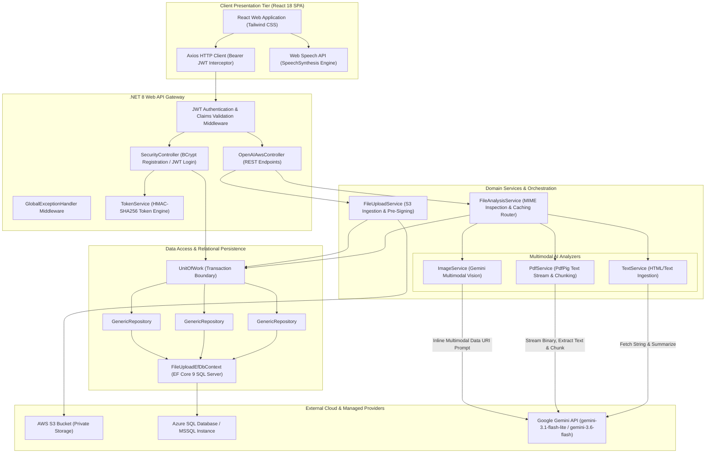

# System Architecture Specification

## 1. Executive Summary

**AWS File Analyzer** is an end-to-end cloud-native document intelligence and multimodal media analysis platform. It enables users to ingest unstructured multi-format files (images, PDFs, text documents) into Amazon S3, routes content through specialized AI processing engines via Google Gemini, persists metadata and cached intelligence in Azure SQL Database, and narrates extracted insights via browser-native speech synthesis.

---

## 2. High-Level Architecture Diagram

---

## 3. Component Breakdown & Responsibilities

### 3.1 Presentation Layer (Frontend)
* **Framework**: React 18, Tailwind CSS v3, Axios.
* **Responsibilities**:
  * `LoginForm.js` / `RegisterForm.js`: Captures user credentials and acquires JWT token.
  * `FileUploadAnalyze.js`: Dispatches multipart uploads and triggers file analysis.
  * `AiVoicePlayer.js`: Wraps browser `window.speechSynthesis` and `SpeechSynthesisUtterance` to read AI-generated summaries aloud.

### 3.2 Gateway & Controllers (.NET 8 Web API)
* **`SecurityController`**:
  * `POST /api/Security/register`: Salted password hashing via `BCrypt.Net.BCrypt.HashPassword`.
  * `POST /api/Security/login`: Verifies passwords via `BCrypt.Net.BCrypt.Verify` and issues signed HMAC-SHA256 JWT access and refresh tokens.
* **`OpenAIAwsController`**:
  * `POST /OpenAIAws/AwsFileUpload`: Receives `IFormFile`, pushes to S3, returns generated Pre-Signed URL.
  * `POST /OpenAIAws/GeminiSummary` (also `/OpenAISummary`): Inspects URL, checks SQL cache, delegates to analyzer service, returns structured JSON.
  * `GET /OpenAIAws/ListS3Files`: Lists objects in S3 bucket with renewed pre-signed URLs.
  * `GET /OpenAIAws/ListLoadHistory`: Queries DB for uploaded files in the last $N$ days.
  * `GET /OpenAIAws/ListAnalysisResults`: Joins `FileUploadHistory` with `FileAnalysisResult`.
  * `POST /OpenAIAws/GeminiChat` (also `/OpenAIChat`): General chat completion endpoint.

### 3.3 Domain Services & AI Pipelines
* **`FileUploadService`**: Manages AWS S3 `PutObjectAsync` and creates 60-minute pre-signed URLs via `GetPreSignedUrlRequest`.
* **`FileAnalysisService`**: Master router. Performs HTTP `GET` header sniffing to detect MIME types (`image/*`, `application/pdf`, `text/*`), checks Azure SQL cache, and persists analysis records.
* **`ImageService`**: Fetches image bytes from S3 pre-signed URL, converts to base64 Data URI part, and invokes Google Gemini (`gemini-3.1-flash-lite`) requesting strict JSON geolocation and landmark metadata.
* **`PdfService`**: Uses `PdfPig` to stream binary PDFs. If text exceeds 12,000 characters, it slices into 4,000-byte segments, gathers partial summaries, and executes an aggregate summarization prompt.
* **`TextService`**: Cleans HTML/whitespace with `HtmlAgilityPack` and produces structured JSON summaries.

---

## 4. Database Schema (Azure SQL / Entity Framework Core)

### `UserLogin`
| Column | Type | Constraints | Purpose |
| :--- | :--- | :--- | :--- |
| `Id` | `int` | Primary Key, Identity | Unique user ID |
| `UserName` | `nvarchar(450)` | Not Null, Unique Index | Unique login handle |
| `PasswordHash` | `nvarchar(max)` | Not Null | BCrypt salted hash string |
| `Role` | `nvarchar(50)` | Nullable | Role authorization claim |

### `FileUploadHistory`
| Column | Type | Constraints | Purpose |
| :--- | :--- | :--- | :--- |
| `Id` | `int` | Primary Key, Identity | Upload event ID |
| `FileName` | `nvarchar(255)` | Not Null | Original file name |
| `FileExtension` | `nvarchar(50)` | Not Null | MIME/extension classification |
| `FileSize` | `bigint` | Not Null | Size in bytes |
| `LoadedTime` | `datetime2` | Not Null | Upload timestamp |
| `PresignedUrl` | `nvarchar(max)` | Not Null | Generated temporary access URL |

### `FileAnalysisResult`
| Column | Type | Constraints | Purpose |
| :--- | :--- | :--- | :--- |
| `Id` | `int` | Primary Key, Identity | Analysis record ID |
| `PresignedUrl` | `nvarchar(450)` | Not Null, Indexed | Matching file URL for cache lookup |
| `AnalysisText` | `nvarchar(max)` | Not Null | JSON response payload from Gemini |

---

## 5. Architectural Trade-Offs & Decisions

| Decision | Selected Option | Alternative Considered | Trade-Off Rationale |
| :--- | :--- | :--- | :--- |
| **AI Provider** | Google Gemini (`gemini-3.1-flash-lite`) | OpenAI GPT-4o | Gemini offers competitive multimodal vision, faster throughput, lower cost, and OpenAI compatibility layer for zero-friction integration. |
| **Media Delivery to LLM** | AWS S3 Pre-Signed URLs + Inline Base64 | Streaming raw byte streams through backend RAM | Eliminates server memory bloat; allows flexible cloud hosting while supporting Gemini's strict input format requirements. |
| **Response Format** | Enforced JSON Object Schema | Free-form Markdown / Natural Language | Guarantees reliable frontend parsing and schema adherence for UI fields without regex parsing. |
| **Result Caching** | Relational Azure SQL Cache | In-memory Redis Cache | Cost efficiency: Leverages existing SQL database without provisioning additional Redis clusters for low-to-medium loads. |
