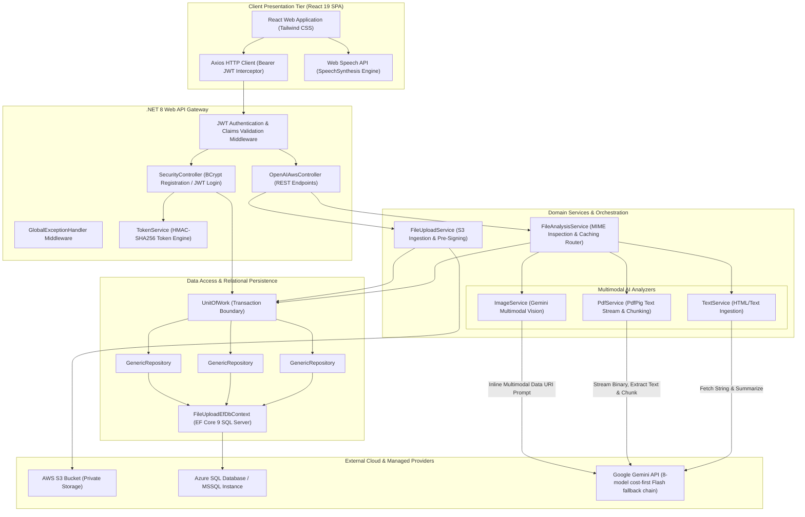

# System Architecture Specification

## 1. Executive Summary

**AWS File Analyzer** is an end-to-end cloud-native document intelligence and multimodal media analysis platform. It enables users to ingest unstructured multi-format files (images, PDFs, text documents) into Amazon S3, routes content through specialized AI processing engines via Google Gemini, persists metadata and cached intelligence in Azure SQL Database, and narrates extracted insights via browser-native speech synthesis.

---

## 2. High-Level Architecture Diagram

---

## 3. Component Breakdown & Responsibilities

### 3.1 Presentation Layer (Frontend)
* **Framework**: React 19 with Vite 8, Tailwind CSS v3, Axios.
* **Responsibilities**:
  * `GuestLanding.jsx`: Presents a public project overview with sample analysis and starts a restricted, short-lived guest session for the live analyzer.
  * `LoginForm.jsx` / `RegisterForm.jsx`: Captures user credentials and acquires JWT token, with support for Google OAuth 2.0 one-tap login and immediate auto-login upon registration.
  * `FileUploadAnalyze.jsx`: Dispatches multipart uploads, triggers multimodal AI analysis, stages guest activity in `pending_guest_claim`, and restores that browser-local state after authentication.
  * `AiVoicePlayer.jsx`: Wraps browser `window.speechSynthesis` and `SpeechSynthesisUtterance` to read AI-generated summaries aloud.

### 3.2 Gateway & Controllers (.NET 8 Web API)
* **`SecurityController`**:
  * `POST /api/Security/guest-session`: Issues a short-lived Guest JWT without inserting an account into Azure SQL.
  * `POST /api/Security/claim-guest-uploads`: Validates that staged guest URLs belong to the configured S3 bucket and acknowledges the authenticated handoff. Durable per-user database ownership is not implemented yet.
  * `POST /api/Security/register`: Salted password hashing via `BCrypt.Net.BCrypt.HashPassword` with automatic JWT issuance.
  * `POST /api/Security/login`: Verifies passwords via `BCrypt.Net.BCrypt.Verify` and issues signed HMAC-SHA256 JWT access and refresh tokens.
  * `POST /api/Security/google-login`: Validates Google ID tokens via `GoogleJsonWebSignature`, provisions new users automatically if non-existent, and issues JWT access tokens.
* **`OpenAIAwsController`** (canonical Swagger prefix `/api/ai`; legacy prefixes retained for compatibility):
  * `POST /api/ai/AwsFileUpload`: Validates up to five supported files for accounts or one file up to 2 MB for guests, pushes them to S3, and returns generated pre-signed URLs.
  * `POST /api/ai/GeminiSummary`: Validates configured-bucket URLs, checks the SQL cache, delegates to the analyzer service, and returns structured JSON.
  * `GET /api/ai/ListS3Files`: Lists objects in S3 with renewed pre-signed URLs.
  * `GET /api/ai/ListLoadHistory`: Queries uploads from the last $N$ days.
  * `GET /api/ai/ListAnalysisResults`: Joins `FileUploadHistory` with `FileAnalysisResult`.
  * `POST /api/ai/GeminiChat`: Provides general text completion through the configured Gemini fallback chain.

Guest JWTs can call only the upload and analysis operations. Bucket listings, account history, saved-result listings, general chat, and guest claim operations require a registered-user role.

### 3.3 Domain Services & AI Pipelines
* **`FileUploadService`**: Manages AWS S3 `PutObjectAsync` and creates 60-minute pre-signed URLs via `GetPreSignedUrlRequest`.
* **`FileAnalysisService`**: Master router. Performs HTTP `GET` header sniffing to detect MIME types (`image/*`, `application/pdf`, `text/*`), checks Azure SQL cache, and persists analysis records.
* **`GeminiChatClient`**: Uses one shared, ordered fallback chain for image, PDF, text, and chat requests: `gemini-3.1-flash-lite` → `gemini-3.5-flash-lite` → `gemini-2.5-flash-lite` → `gemini-2.5-flash` → `gemini-3.5-flash` → `gemini-3.6-flash` → `gemini-3.7-flash` → `gemini-3.8-flash`. It retries transient failures with bounded backoff and moves to the next model for rate-limit or model-availability failures.
* **`ImageService`**: Fetches image bytes from an S3 pre-signed URL, converts them to an inline image part, and invokes the shared Gemini fallback client for strict JSON geolocation and landmark metadata.
* **`PdfService`**: Uses `PdfPig` to extract text from binary PDFs. If extracted text exceeds 12,000 characters, it slices the text into 4,000-character segments, summarizes each segment sequentially, and runs a final aggregate summarization prompt.
* **`TextService`**: Cleans HTML/whitespace with `HtmlAgilityPack` and produces structured JSON summaries.

---

## 4. Database Schema (Azure SQL / Entity Framework Core)

### `UserLogin`
| Column | Type | Constraints | Purpose |
| :--- | :--- | :--- | :--- |
| `Id` | `int` | Primary Key, Identity | Unique user ID |
| `Username` | `nvarchar(100)` | Not Null | Login handle or Google-account email |
| `Password` | `nvarchar(max)` | Not Null | BCrypt salted password hash; Google-created users receive a random unusable password |

### `FileUploadHistory`
| Column | Type | Constraints | Purpose |
| :--- | :--- | :--- | :--- |
| `Id` | `int` | Primary Key, Identity | Upload event ID |
| `LocalFileName` | `nvarchar(90)` | Not Null | Original file name |
| `FileLengthInBytes` | `int` | Not Null | Size in bytes |
| `AwsKey` | `nvarchar(60)` | Nullable | S3 object key |
| `PresignedUrl` | `nvarchar(480)` | Nullable | Generated temporary access URL |
| `LoadTime` | `datetimeoffset` | Not Null | Upload timestamp |
| `FileExtension` | `nvarchar(20)` | Nullable | MIME/extension classification |

### `FileAnalysisResult`
| Column | Type | Constraints | Purpose |
| :--- | :--- | :--- | :--- |
| `Id` | `int` | Primary Key, Identity | Analysis record ID |
| `PresignedUrl` | `nvarchar(480)` | Not Null | Exact signed URL used for cache lookup |
| `AnalysisText` | `nvarchar(max)` | Nullable | JSON response payload from Gemini |

---

## 5. Architectural Decisions

| Decision | Selected Option | Alternative Considered | Trade-Off Rationale |
| :--- | :--- | :--- | :--- |
| **AI Provider** | Google Gemini Flash hierarchy (`gemini-3.1-flash-lite` through `gemini-3.8-flash`) | One fixed model or OpenAI-only integration | Lower-cost models are attempted first, while later models provide resilience when a model is rate-limited or unavailable. |
| **Media Delivery to LLM** | Private S3 + short-lived pre-signed URLs; backend inlines image bytes for Gemini | Public objects or browser-held cloud credentials | Keeps the bucket private and credentials server-side. The API still buffers image content for the multimodal request, which is acceptable under the current upload limits. |
| **Response Format** | Enforced JSON Object Schema | Free-form Markdown / Natural Language | Guarantees reliable frontend parsing and schema adherence for UI fields without regex parsing. |
| **Result Caching** | Relational Azure SQL cache keyed by exact pre-signed URL | In-memory Redis cache | Reuses the existing SQL database without another service, but URL expiration means object-key-based caching would be more durable. |
| **Frontend Hosting** | Cloudflare Pages, plus a Git-connected Worker mirror | Azure Static Web Apps / S3 Website | Pages preserves the established public URL and deploys after green CI; the Worker mirror demonstrates Cloudflare Builds but duplicates the frontend until a single hostname is selected. |
| **Secrets Management**| Azure Key Vault + Managed Identity | App Settings / Environment Variables | Prevents credential exposure in source code or CI logs; secrets are resolved at runtime via passwordless Entra ID identity tokens. |

---

## 6. Multi-Cloud Deployment & Zero-Trust Infrastructure

### 6.1 Topology & Endpoints
* **Frontend CDN**: [https://aws-file-analyzer.pages.dev](https://aws-file-analyzer.pages.dev) (Cloudflare Pages)
* **Git-connected frontend deployment**: [https://aws-file-analyzer.bradshin231.workers.dev](https://aws-file-analyzer.bradshin231.workers.dev) (Cloudflare Worker static assets)
* **Backend API**: [https://app-afa-eycaz6z3q3pp4.azurewebsites.net](https://app-afa-eycaz6z3q3pp4.azurewebsites.net) (Azure App Service Linux F1)
* **Database**: `sql-afa-eycaz6z3q3pp4.database.windows.net` / `FileAnalyzer` (Azure SQL Serverless `GP_S_Gen5_1`)
* **Key Vault**: `kv-afa-eycaz6z3q3pp4.vault.azure.net` (Azure Key Vault with RBAC)
* **Storage**: AWS S3 Bucket `aws-file-analyzer-bd3b69e5` (`us-east-2`)

### 6.2 Zero-Trust Security Architecture
1. **Passwordless Managed Identity**: The App Service uses a System-Assigned Managed Identity assigned the `Key Vault Secrets User` role. Secrets (`gemini-api-key`, `jwt-key`, `aws-access-key-id`, `aws-secret-access-key`) are referenced using `@Microsoft.KeyVault(...)` syntax and resolved into App Service settings without storing them in the repository or GitHub Actions.
2. **Database Least Privilege**: Azure SQL data-plane access for the App Service identity is granted explicitly via Entra ID SQL role mappings (`db_datareader`, `db_datawriter`), preventing the need for embedded SQL administrative credentials.
3. **CORS Boundary**: Kestrel enforces a strict origin policy allowing `https://aws-file-analyzer.pages.dev`, `https://aws-file-analyzer.bradshin231.workers.dev`, and local development origins, rejecting unapproved third-party web clients.

### 6.3 Cost Optimization & \$0 Spending Target
* **App Service**: F1 Free SKU minimizes API compute cost within that tier's quotas.
* **Azure SQL Serverless**: `GP_S_Gen5_1` pauses automatically after 60 minutes of inactivity and can use available student/free grants.
* **Cloudflare Pages**: Hosted on the free tier with edge delivery and automatic SSL certificates.
* **AWS S3 and Gemini**: Low demo traffic is intended to remain within small usage or free-tier allowances, but charges and quotas depend on the active accounts and current provider terms.
